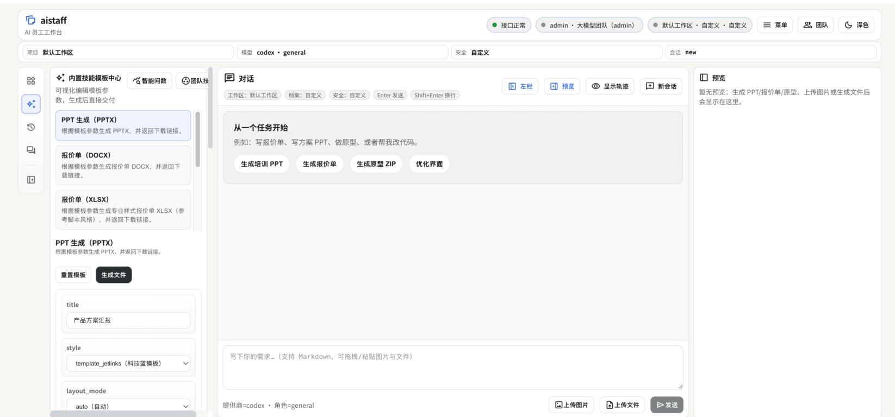

# JetLinks AI

[English](README.md) | [简体中文](README.zh-CN.md) | [日本語](README.ja.md) | [한국어](README.ko.md)

JetLinks AI は、チーム向けの **セルフホスト可能な AI ワークスペース** です。  
**対話（チャット）駆動の実行** と **チーム運用（権限/分離）** を中心に設計しています。

- フロントエンド: Vue 3 + Vite
- バックエンド: FastAPI（認証、マルチチーム分離、Agent オーケストレーション、ファイル/ドキュメント）
- 内蔵: チャット + 履歴、アップロード/ダウンロード、ドキュメント生成（PPT/見積/検品）、プロトタイプ生成、Feishu/WeCom Webhook
- セキュアデフォルト: 高リスク機能（`shell/write/browser`）は **既定で無効**（必要時のみ有効化）

## スクリーンショット



## クイックスタート

### 前提条件

- Node.js `>= 22` + `pnpm`
- Python `>= 3.10` + `uv`

任意:

- LibreOffice（PPT の表紙プレビュー画像生成に使用。PPTX 自体の生成は不要）
- Playwright（ブラウザツール用。既定で無効）

### 起動（推奨）

```bash
pnpm dev
# または
bash scripts/dev.sh
```

URL:

- Web: `http://127.0.0.1:5173`
- API: `http://127.0.0.1:8000`
- Health: `http://127.0.0.1:8000/health`

初回は UI 上で **Setup** を完了し、最初の管理者ユーザーとチームを作成します。

### 最小設定

```bash
cp .env.example .env
```

チャット/Agent を使う場合は `.env` の `OPENAI_API_KEY` を設定してください。

## データベース（SQLite / Postgres）

- 既定: SQLite（追加設定なし）
- 本番推奨: `JETLINKS_AI_DB_URL=postgresql://...` で Postgres を利用
- Postgres マイグレーション（Alembic）:

```bash
cd backend
uv run alembic upgrade head
```

バックエンド詳細: `backend/README.md`。

## 主な機能

- マルチチーム（ユーザー/チーム/招待/切替）
- チーム運用（プロジェクト、スキル/プロンプト、要件ボード）
- チーム間引き渡し（Delivery）：要件を他チームへ交付し、受け取り/拒否を可能に
- Provider: OpenAI / Pi（pi-mono）/ Codex / OpenCode / Nanobot
- ドキュメント生成:
  - PPTX（スタイル + レイアウト、PPT テンプレートをアップロードして `template_file_id` で反映）
  - 見積書（DOCX / XLSX）
  - 検品書（DOCX / XLSX）
- プロトタイプ生成（HTML ZIP + プレビュー）

## チーム間の要件引き渡し（Delivery）

要件ボードは既存の `team_requirements` ステータス（`incoming/todo/in_progress/done/blocked`）を使います。要件作成時に、構造化された `delivery` 情報を任意で付けることで、要件を**別チームへ交付**できます。

- 交付の発起（送信元チーム `owner/admin`）：`delivery.target_team_id` を付けて要件を作成
  - 要件は **送信先チーム** に作成されます（`team_id=target_team_id`）
  - 強制設定：`status=incoming`、`source_team=<送信元チーム名>`、`delivery_state=pending`
- 受け取り/拒否（送信先チーム `owner/admin`）：
  - 受け取り：`POST /api/team/requirements/{requirement_id}/accept`（`delivery_state=accepted`。`status=incoming` の場合は `todo` に進めます）
  - 拒否：`POST /api/team/requirements/{requirement_id}/reject`（`delivery_state=rejected`。拒否された交付は既定の一覧から非表示）

注: 現在は **単一レコード方式**です。要件は送信先チーム側にのみ存在し、送信元チーム側に自動ミラーは作りません。

## 中央リファレンスリポジトリ（Reference Repo）

社内の「中央コード参照リポジトリ」（規約、テンプレート、SDK、サンプル等）を用意し、各チームが選択可能なプロジェクト/ワークスペースとして参照する運用ができます。

- サーバ側の許可範囲：`JETLINKS_AI_PROJECTS_ROOT` が、チームが追加できるディレクトリ白リストを定義します（既定は `JETLINKS_AI_WORKSPACE`）
- チーム設定（チーム `owner/admin`）：UI の「プロジェクト/ワークスペース管理」で中央リポジトリのパスを `team_projects` に追加（「一括インポート」で roots をスキャンして追加も可能）
- チャット時の適用：
  - `project_id` あり：該当プロジェクトの `path` を `workspace_root` として使用（`fs_list/fs_read/...` などのツールはその配下で実行）
  - `project_id` なし：チームのワークスペース（`/api/team/settings`）を使うか、未設定なら `JETLINKS_AI_WORKSPACE` にフォールバック

推奨:

- 同じリポジトリを「共有」したい場合は、各チームの `team_projects` に同一パスを追加します（設定がチームごとに分離されるだけで、ファイルをコピーしません）
- 機密は置かず、運用では `JETLINKS_AI_ENABLE_WRITE=0` を基本にして参照用（読み取り中心）にするのがおすすめです

## API 例：見積書生成（XLSX / DOCX）

注意:

- 見積書エンドポイントは認証が必要です: `Authorization: Bearer <access_token>`
- `download_url` は通常 **相対パス**（例: `/api/files/...`）。`JETLINKS_AI_PUBLIC_BASE_URL` を設定すると絶対 URL になります。

### 1) ログインして token を取得

```bash
API=http://127.0.0.1:8000

TOKEN=$(
  curl -sS -X POST "$API/api/auth/login" \
    -H 'Content-Type: application/json' \
    -d '{"email":"admin@example.com","password":"your-password"}' \
  | python -c 'import sys,json; print(json.load(sys.stdin)["access_token"])'
)
```

### 2) XLSX 見積書を生成（推奨）

```bash
META=$(
  curl -sS -X POST "$API/api/docs/quote-xlsx" \
    -H "Authorization: Bearer $TOKEN" \
    -H 'Content-Type: application/json' \
    -d '{
      "seller": "ACME Co., Ltd.",
      "buyer": "Example Customer Inc.",
      "currency": "CNY",
      "items": [
        { "name": "Self-hosted deployment", "quantity": 1,  "unit_price": 68000, "unit": "set",  "note": "1 year support included" },
        { "name": "Customization (team/requirements)", "quantity": 20, "unit_price": 1500,  "unit": "day",  "note": "iterative delivery" }
      ],
      "note": "Valid for 30 days."
    }'
)

echo "$META" | python -m json.tool
```

### 3) 生成ファイルをダウンロード

```bash
DOWNLOAD_URL=$(echo "$META" | python -c 'import sys,json; print(json.load(sys.stdin)["download_url"])')

case "$DOWNLOAD_URL" in
  http*) FULL_URL="$DOWNLOAD_URL" ;;
  *)     FULL_URL="$API$DOWNLOAD_URL" ;;
esac

curl -L "$FULL_URL" -o quote.xlsx
```

### 4) DOCX（任意）

同じリクエストで `/api/docs/quote` を呼び出します。

## ライセンス

Apache-2.0（`LICENSE` を参照）。
