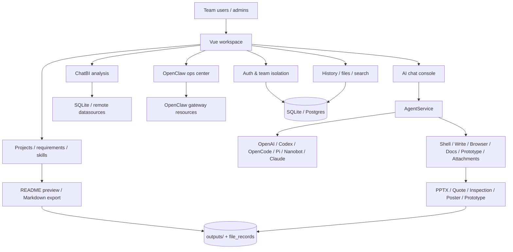
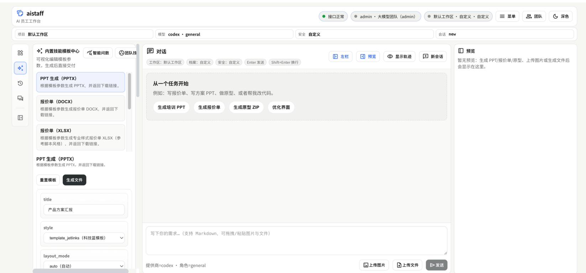
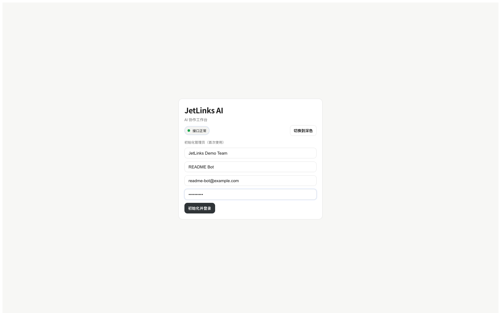
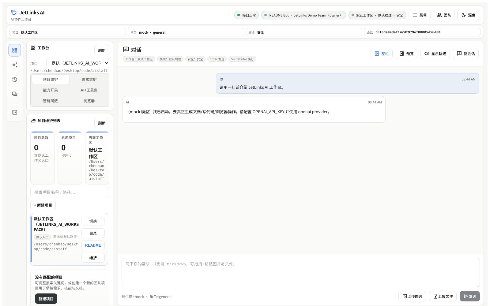
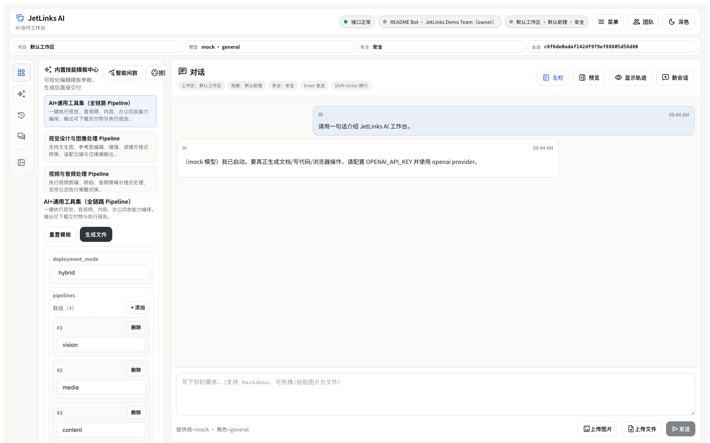
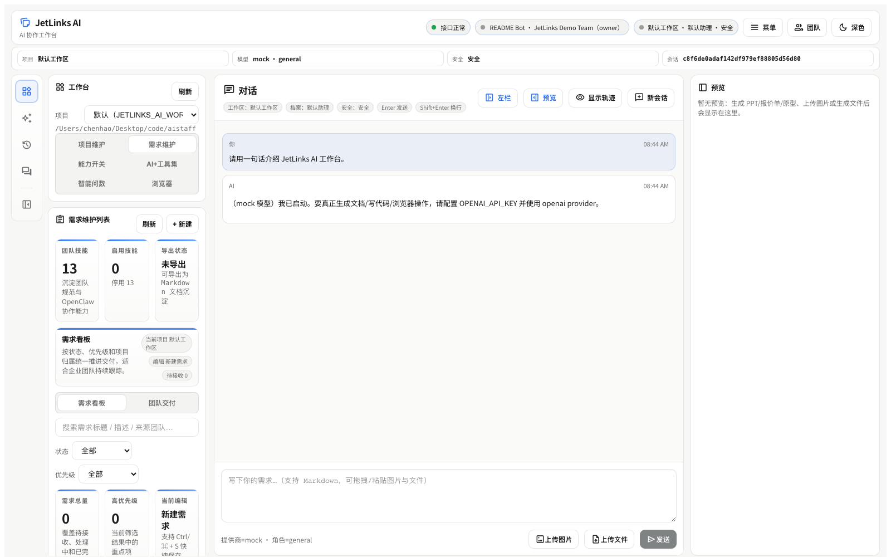
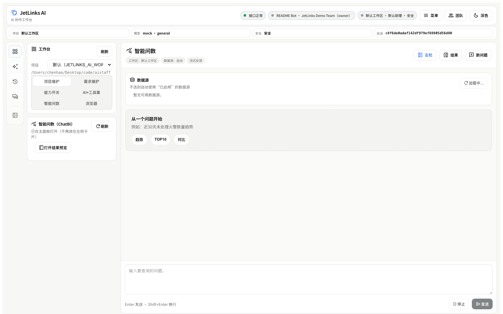

# JetLinks AI · Enterprise OpenClaw Workspace

[English](README.md) | [简体中文](README.zh-CN.md) | [日本語](README.ja.md) | [한국어](README.ko.md)

JetLinks AI is an open-source, self-hosted **AI delivery workspace for teams**.
You can think of it as an **enterprise-ready OpenClaw workspace**: chat-driven execution, shared team context, project / requirement management, deliverable automation, and OpenClaw operations in one product.

> From idea to execution to deliverables — chat, projects, docs, prototypes, and OpenClaw ops in one place.

> Acknowledgements: JetLinks AI includes optional integration points inspired by the OpenClaw gateway. Thanks to the OpenClaw project and community.

## Why teams like it

- **More than chat**: combine AI chat, team skills, requirement tracking, and project coordination in one workspace
- **Built for delivery**: generate PPTX, quotations, inspection sheets, prototypes, and posters without leaving the app
- **OpenClaw-ready**: manage gateway status, channel/plugin/skill sync, and team-scoped OpenClaw resources
- **Self-hosted and controllable**: FastAPI + Vue stack, SQLite/Postgres support, secure-by-default tool gating
- **Enterprise-friendly UX**: multi-team collaboration, workspace isolation, admin controls, and mobile-friendly layouts

## Highlights

- **Team-first workspace**: users, teams, invites, role-based operations, project/workspace switching
- **AI workbench**: chat, history, uploads/downloads, built-in skills, team prompt skills, shared context
- **Deliverable generation**: PPTX, quotation, inspection sheet, HTML prototype, SVG poster / long image
- **AI+ toolkit pipelines**: vision, media, content, office, and full-stack orchestration pipelines
- **OpenClaw operations center**: status probe, one-click sync, channel/plugin/skill management, team-scoped skill registry
- **Secure by default**: high-risk tools (`shell`, `write`, `browser`) are disabled unless explicitly enabled

## Platform Capability Overview

| Domain | What users can do | Key routes / modules |
| --- | --- | --- |
| Identity & multi-team | Setup first admin, login/register, switch active team, manage invites and members | `/api/auth/*`, `/api/team/invites`, `/api/team/members` |
| Workspace & projects | Register repositories, discover/import projects, browse workspace tree, preview README, export Markdown | `/api/team/projects*`, `/api/team/workspace/*`, `/api/team/export-md` |
| Requirement collaboration | Create requirements, assign delivery teams, accept/reject outgoing work | `/api/team/requirements*` |
| AI chat & agent execution | Run chat tasks with provider selection, attachments, security presets, and team context | `/api/chat`, `AgentService`, `agent/tools/*` |
| Skills center | Use built-in pipelines and maintain team prompt skills, including AI draft generation | `/api/skills`, `/api/skills/pipeline/*`, `/api/team/skills*` |
| Deliverables | Generate PPTX, quotation, inspection sheet, poster, and HTML prototype with preview/download | `/api/docs/*`, `/api/prototype/*`, `/api/files/*` |
| History & retrieval | Review sessions/files, replay context, search workspace and history snapshots | `/api/history/*` |
| ChatBI | Manage datasources, ask questions in natural language, stream SQL + analysis results | `/api/chatbi/*` |
| Browser & controlled tools | Start a browser session, navigate, take screenshots, and gate shell/write/browser tools | `/api/browser/*`, tool gating in `.env` |
| OpenClaw & external channels | Probe gateway status, sync channels/plugins/skills, receive OpenClaw/Feishu/WeCom events | `/api/team/openclaw/*`, `/api/integrations/openclaw/message`, `/api/feishu/*`, `/api/wecom/*` |

## Providers, Profiles, and Safety Levels

### Provider matrix

Provider availability is dynamic. The frontend reads `/api/meta`, and the actual list depends on your local runtime, `.env`, and installed CLIs.

| Provider | Best for | Notes |
| --- | --- | --- |
| `openai` | General chat, docs, PPT, quotations, prototypes | Built-in full toolchain; best default for deliverable generation |
| `glm` | Alternative LLM provider | Appears when `GLM_API_KEY` is configured |
| `codex` | Local coding tasks and repo changes | Works with local Codex CLI; supports optional dangerous mode |
| `claude` | Local Claude CLI workflows | Appears only when the configured Claude command is available |
| `opencode` | Agent loop with approvals | Good for engineering workflows; some doc/prototype cases fall back to built-in tools |
| `nanobot` | External coding/task agent | Useful for delegated execution; doc/prototype cases can fall back to built-in tools |
| `openclaw` | OpenClaw-connected runtime | Exposed when OpenClaw integration is enabled |
| `pi` | Pi coding agent | Appears when `JETLINKS_AI_ENABLE_PI=1` |
| `mock` | Demo, testing, screenshots | Safe fake provider with deterministic responses |

### Built-in agent profiles

The workspace can apply preset combinations of provider + role + UI vibe + safety level:

| Profile | Default provider | Role | Safety | Typical use |
| --- | --- | --- | --- | --- |
| Default Assistant | `opencode` | `general` | `safe` | Day-to-day team tasks |
| Engineer Mode | `opencode` | `engineer` | `power` | Code edits, repo work, tool-heavy flows |
| Writer Mode | `openai` | `general` | `standard` | PPT, quotations, documentation |
| Prototype Mode | `openai` | `engineer` | `standard` | HTML pages, prototype artifacts |
| Research Mode | `openai` | `general` | `safe` | Information synthesis with minimal permissions |
| Custom | Current selection | manual | manual | Fine-grained control per session |

### Safety presets

The frontend can request a lower-risk or higher-capability session, but the server-side `.env` remains the hard upper bound.

| Preset | Shell | Write | Browser | Use case |
| --- | --- | --- | --- | --- |
| `safe` | off | off | off | Read-only chat and analysis |
| `standard` | off | on | off | Document creation and file output |
| `power` | on | on | on | Full tool usage for admins/engineering tasks |
| `custom` | manual | manual | manual | Explicit per-toggle control |

### How to choose a provider

| If you want to… | Recommended provider | Why |
| --- | --- | --- |
| Generate PPT, quotations, posters, inspection sheets, or prototypes reliably | `openai` | It uses the built-in document/prototype toolchain directly |
| Edit code in a local repository with stronger engineering workflow support | `codex` | Best fit for local code changes and repo-aware coding tasks |
| Run approval-oriented agent loops for engineering collaboration | `opencode` | Better aligned with reviewed / gated execution flows |
| Use an alternative domestic model endpoint | `glm` | Good when your deployment standardizes on GLM |
| Route tasks into an OpenClaw-connected runtime | `openclaw` | Best when your team already operates around OpenClaw resources |
| Demonstrate the UI without real model cost or credentials | `mock` | Safe for screenshots, demos, and smoke checks |

Practical rule of thumb:

- Start with `openai` for deliverables and general-purpose work
- Use `codex` when the task is clearly “modify code in this repo”
- Use `opencode` when you want stronger approval-style engineering flow
- Use `mock` for onboarding, screenshots, and local demos
- Switch only when your infra, compliance, or workflow specifically requires another provider

## Workspace Navigation

### Left-side sections

| Section | What it contains |
| --- | --- |
| Workspace | Projects, requirements, capability toggles, AI+ toolkit, browser, ChatBI |
| Skills | Built-in skill templates and team prompt skills |
| History | Session history, generated files, workspace/history search |
| Session | Runtime trace, current conversation context, execution state |

### Workspace tabs

| Tab | Purpose |
| --- | --- |
| Projects | Project registry, directory tree, README preview, import/discover |
| Requirements | Requirement board, cross-team delivery, acceptance/rejection flow |
| Capabilities | Provider/profile selection, safety presets, shell/write/browser toggles |
| AI+ Toolkit | Pipeline-style tools for vision, media, content, and office scenarios |
| ChatBI | Natural-language BI queries over local or remote datasources |
| Browser | Built-in browser session, navigation, and screenshots |

## Service Topology



## Included Backend Services

- **`AuthService`**: user setup, login, registration, team switching, and access control
- **`AgentService`**: provider routing, tool orchestration, session restore, and event tracing
- **`DocService` + `services/docs/*`**: PPT, quotation, inspection sheet, and poster generation
- **`PrototypeService`**: HTML prototype packaging and in-app preview
- **`QueryEngine` + `services/chatbi/*`**: ChatBI datasource management, SQL generation, execution, and analysis
- **`OpenClawAdminService`**: OpenClaw status probing, sync, and team-scoped resource management
- **`FeishuWebhookService` / `WecomService`**: inbound IM callbacks and team integrations
- **`TeamExportService` / `history_file_store`**: workspace export, file indexing, and historical retrieval

## Architecture

- **Frontend**: Vue 3 + Vite
- **Backend**: FastAPI
- **Data**: SQLite by default, Postgres supported
- **Artifacts**: generated files are stored in `outputs/` or the configured runtime directory
- **Optional upstream integrations**: OpenClaw / OpenCode / Pi via vendored submodules

## Preview




### More Screenshots

| Setup & onboarding | Workspace & README preview |
| --- | --- |
|  |  |

| Built-in skills center | AI chat workspace |
| --- | --- |
|  |  |

| ChatBI workspace |
| --- |
|  |

## Quick Start

### Prerequisites

- Node.js `>= 22` + `pnpm`
- Python `>= 3.10` + `uv`

Optional:

- LibreOffice (for PPT cover preview generation)
- Playwright (for browser tool and UI smoke testing)

### Run locally

```bash
pnpm dev
# or
bash scripts/dev.sh
```

Default URLs:

- Web: `http://127.0.0.1:5173`
- API: `http://127.0.0.1:8000`
- Health: `http://127.0.0.1:8000/health`
- Ready: `http://127.0.0.1:8000/ready`

On first launch, complete the **Setup** flow in the UI to create the first admin user and team.

### Minimal configuration

```bash
cp .env.example .env
```

If you want chat / agent capability, set at least:

```bash
OPENAI_API_KEY=your-key
```

### Run with Docker (self-host)

This repo includes a simple Docker Compose setup (single container + SQLite by default):

```bash
docker compose -f docker/docker-compose.yml up -d --build
```

Default URL: `http://127.0.0.1:8001` (UI + API), health: `http://127.0.0.1:8001/health`.

More details: `docker/README.md`.

## Feature Map

### Workspace and team collaboration

- Multi-team user model with invites, memberships, and active-team switch
- Team workspace settings and project / repository management
- Team skills (prompt templates) and requirement board
- Cross-team delivery workflow with accept / reject states

### Built-in deliverables

- **PPTX** generation with template-based rendering
- **Quotation** generation in DOCX / XLSX
- **Inspection sheet** generation in DOCX / XLSX
- **Prototype** generation as HTML ZIP + preview
- **Poster / long image** generation as SVG via `/api/docs/poster`

### AI+ toolkit pipelines

Built-in skill catalog now includes pipeline-style capabilities:

- `vision`: image enhancement / conversion / resize-oriented flow
- `media`: short video / audio handling flow
- `content`: proposal, content-pack, and deliverable generation flow
- `office`: project / office automation flow
- `full`: combined end-to-end orchestration flow

### OpenClaw integration and ops

JetLinks AI now includes a team-facing OpenClaw operations area:

- Gateway status probing and runtime visibility
- One-click sync of discovered OpenClaw resources
- Team-scoped **channels / plugins / skills** CRUD
- Team-scoped OpenClaw skill discovery and counters
- Config editing experience aligned closer to original OpenClaw channel metadata structure

## Database

- Default: SQLite (zero extra setup)
- Production: Postgres via `JETLINKS_AI_DB_URL=postgresql://...`
- If an old `.aistaff/aistaff.db` exists and `.jetlinks-ai/jetlinks_ai.db` does not, JetLinks AI auto-migrates runtime data into `.jetlinks-ai/` on first start.

Run migrations for Postgres:

```bash
cd backend
uv run alembic upgrade head
```

More backend details: `backend/README.md`.

## Health and readiness

- `GET /health`: liveness check
- `GET /ready`: readiness check with DB/runtime path information
- `GET /api/ready`: API-scoped readiness endpoint

## API Example: Generate a quotation (XLSX / DOCX)

Notes:

- Quotation endpoints require auth: `Authorization: Bearer <access_token>`
- `download_url` is usually relative (for example `/api/files/...`)
- If `JETLINKS_AI_PUBLIC_BASE_URL` is configured, generated links become absolute URLs

### 1) Login and get a token

```bash
API=http://127.0.0.1:8000

TOKEN=$(
  curl -sS -X POST "$API/api/auth/login" \
    -H 'Content-Type: application/json' \
    -d '{"email":"admin@example.com","password":"your-password"}' \
  | python -c 'import sys,json; print(json.load(sys.stdin)["access_token"])'
)
```

### 2) Generate an XLSX quotation

```bash
META=$(
  curl -sS -X POST "$API/api/docs/quote-xlsx" \
    -H "Authorization: Bearer $TOKEN" \
    -H 'Content-Type: application/json' \
    -d '{
      "seller": "ACME Co., Ltd.",
      "buyer": "Example Customer Inc.",
      "currency": "CNY",
      "items": [
        { "name": "Self-hosted deployment", "quantity": 1,  "unit_price": 68000, "unit": "set",  "note": "1 year support included" },
        { "name": "Customization (team/requirements)", "quantity": 20, "unit_price": 1500,  "unit": "day",  "note": "iterative delivery" },
        { "name": "Training + handover docs", "quantity": 2,  "unit_price": 2000,  "unit": "session" }
      ],
      "note": "Valid for 30 days."
    }'
)

echo "$META" | python -m json.tool
```

### 3) Download the generated file

```bash
DOWNLOAD_URL=$(echo "$META" | python -c 'import sys,json; print(json.load(sys.stdin)["download_url"])')

case "$DOWNLOAD_URL" in
  http*) FULL_URL="$DOWNLOAD_URL" ;;
  *)     FULL_URL="$API$DOWNLOAD_URL" ;;
esac

curl -L "$FULL_URL" -o quote.xlsx
```

## Integrations (optional)

This repo vendors optional upstream projects as git submodules:

- `third_party/openclaw`: OpenClaw gateway and multi-channel messaging
- `third_party/opencode`: OpenCode agent loop and approval flow
- `third_party/pi-mono`: Pi agent SDK / coding agent

If you need them:

```bash
git submodule update --init --recursive
```

### Pi provider

- Enable: `JETLINKS_AI_ENABLE_PI=1`
- Then select provider `pi` in the UI, or set `JETLINKS_AI_PROVIDER=pi`
- Requirements: Node.js `>= 20` or Docker via `JETLINKS_AI_PI_BACKEND=docker`

### OpenClaw gateway webhook

1. Create an integration token as team owner/admin:
   - `POST /api/team/integrations/openclaw`
2. Send messages from your gateway:
   - `POST /api/integrations/openclaw/message`
   - Header: `x-jetlinks-ai-integration-token: <token>`

## Development

Backend only:

```bash
cd backend
uv sync
uv run uvicorn jetlinks_ai_api.main:app --reload --port 8000
```

Frontend only:

```bash
cd frontend
pnpm i
pnpm dev
```

## Testing

Frontend build:

```bash
pnpm -C frontend build
```

Backend tests:

```bash
cd backend
uv run python -m pytest
```

Useful smoke checks:

```bash
curl http://127.0.0.1:8000/health
curl http://127.0.0.1:8000/ready
```

## Production deployment

Goal: build the frontend and let the backend serve `frontend/dist` at `/` so users access a single host such as `https://your-domain/`.

### 1) Install prerequisites

- Node.js `>= 22` + `pnpm`
- Python `>= 3.10` + `uv`

Optional:

- LibreOffice (`soffice`)
- Poppler (`pdftoppm`)
- CJK fonts such as Noto Sans CJK / Source Han Sans

### 2) Configure `.env`

Recommended:

```bash
OPENAI_API_KEY=...
JETLINKS_AI_PUBLIC_BASE_URL=https://your-domain
```

More operational detail is available in `backend/README.md`.
